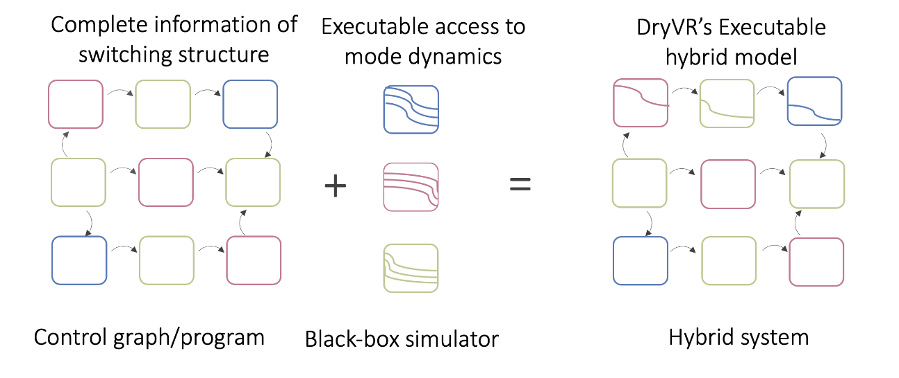

**please reference to https://gitlab.engr.illinois.edu/dryvrgroup/dryvrtool**

**personal modification on DryVR**
==================
fix minor setup error and build error due to dependencies misalignment. Now the project can successful build with following command.
new example model (MPC, stanley), and config files (MPC, stanley) 
  
  -example/MPC/MPC.py
  
  -example/stanley/stanley.py

  -input/nondaginput/mpc_car.json

  -input/nondaginput/stanley.json

**official introduction**
==================
DryVR 2.0 is a software tool for verifying cyber-physical and autonomoous systems. A key feature of DryVR is that it supports reachability analysis of _gray-box_ systems, that is, systems that are described in part as a white box transition system or a program and in part as a black-box simulator as shown in the figure below.



The white-box transition system is specified as a JSON file and the black-box simulator can be written in any language. DryVR uses PAC-learning to learn a sensitivity function for the black-box and combines that with reachanbility analysis on the transition graph. The tool has been used to verify ground and aeiral vehicle models in complex scenarios. You can find more detailed documentation and usages from https://dryvrtool.readthedocs.io.


Note that there are three branches: `master`: it is based on Python 3 and supports hybrid models; `symmetries`: it is the modification of the master branch created to support symmetry-based acceleration for reachtube computations created for this ATVA 2019 paper: "Using symmetry transformations in equivariant dynamical systems for their safety verification" by Hussein Sibai, Navid Mokhlesi, and Sayan Mitra, however it does not support hybrid models; `dryvr2`: it is the deprecated version using Python 2.7 which support all features of DryVR 2.0.


Installation
==================
Following installation instructions has been tested with Python 3 on Ubuntu 16.04 and 20.04.

For Python 3.5 or above on Ubuntu 16.04 or 20.04, try the following instructions.

```bash
$ sudo apt-get install python3-pip python3-cairo python3-tk python3-pygraphviz libglpk-dev
$ pip3 install --user --upgrade pip  # Upgrade pip first
$ pip3 install --user -r requirements.txt
```

If using Python 3 `venv` virtual environment on Ubuntu 16.04 or 20.04, try the following instructions.
```bash
$ sudo apt-get install python3-pip libcairo2-dev libgraphviz-dev libglpk-dev
$ pip3 install --upgrade pip  # Upgrade pip first
$ pip3 install -r requirements.txt
```

Quick Start
==================
To run verification examples, please run 

```bash
python main.py input/[input_file]
```

for example:

```bash
python main.py input/daginput/input_thermo.json
```

The examples descriptions can be found in the documentation. Please note that as the verification algorithm uses probabilistic method, the verification result may vary for different runs.


To run controller synthesis, please run:
------------------------------------------------------------

```bash
python graphSearch.py input/[input_file]
```

for example:

```bash
python graphSearch.py input/rrtinput/mazefinder.json
```

